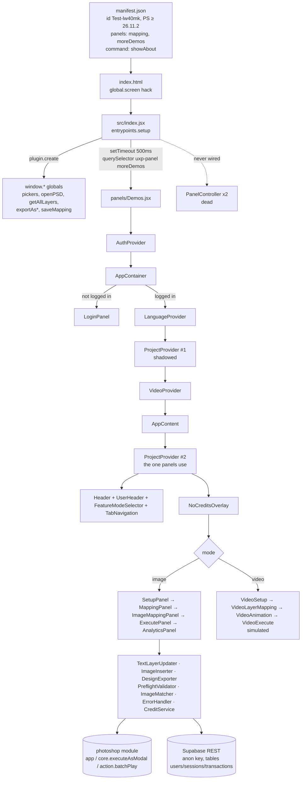
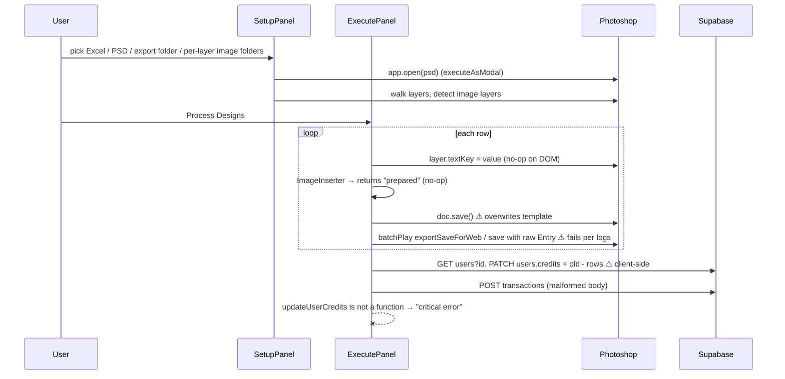
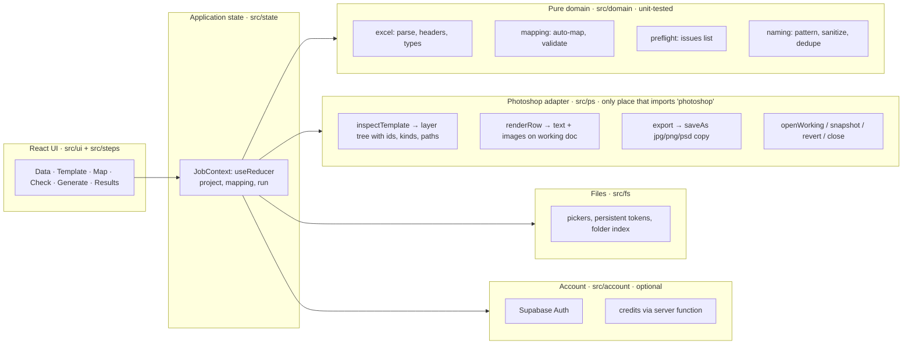

# Elzoz Photoshop Plugin — Technical & Product Audit

> **Update 2026-10-09:** The product owner made final decisions (pre-launch, secure server-side credits, real Video Mode, widest practical Photoshop support, full redesign). The roadmap, architecture, credits, video, and compatibility sections are superseded by [`docs/PLAN.md`](../PLAN.md). The findings, bug register, and feature matrix below remain the baseline record of the code as received.

**Audit date:** 2026-10-09
**Input:** `Test-lw40mk_2.zip` (236 files: 59 source files ≈ 14.4k lines, 74 status/plan documents, a prebuilt `dist/`, no Git history)
**Method:** Full read of every live source file, import-graph analysis, a clean `npm ci` + `webpack` build, `npm audit`, and verification of Photoshop/UXP API claims against Adobe's official docs source (`github.com/AdobeDocs/uxp-photoshop`).
**Not done:** No Photoshop runtime testing (none available here). Nothing below is claimed as *working in Photoshop* unless marked so. The live Supabase project was **not** queried or probed.

Evidence references use `path:line` relative to the ZIP's project root (`Test-lw40mk 2/`).

---

## Deliverable 1 — Executive Summary

**What it is.** A Photoshop UXP panel (React 16 + webpack) that reads an Excel file, opens a PSD template, lets the user map spreadsheet columns to text layers and image layers, and is meant to generate one exported design per row. It also has a login/credit system backed by Supabase and a "Video" mode.

**What genuinely exists (code-level, not Photoshop-verified):**
- File pickers for Excel, PSD, image folders, and export folder (UXP `localFileSystem`). The project's own logs show these ran in Photoshop.
- Excel parsing with SheetJS (first sheet only, `sheet_to_json`).
- Opening the PSD and walking its layer tree (nested groups included).
- Column→text-layer mapping UI and image-layer→folder→column mapping UI.
- A preflight check that only tests whether image files exist.
- A row loop in `ExecutePanel` with error capture.
- English/Arabic translations with RTL handling.

**What is broken, fake, or missing — the core value is not delivered yet:**
1. **Text replacement almost certainly does nothing.** The code writes `layer.textKey = …` (`src/services/TextLayerUpdater.js:229`). The Photoshop DOM has no `textKey` property; the documented API is `layer.textItem.contents` (PS 24.1+). The "100% text success" in the docs comes from the code's own "Successfully updated" log line, printed after an assignment that cannot fail.
2. **Image insertion is a stub.** `_placeImageInSmartObject` and `_replaceRasterLayer` return `{ success: true, status: 'prepared' }` without touching Photoshop (`src/services/ImageInserter.js:69-117`).
3. **Export is broken.** The project's own `LOG_ANALYSIS.md` records JPG export failing (`-25920`) and PSD export failing (`-1715`). The current code still passes a raw `Entry` object to `batchPlay`, where Adobe requires a session token, and uses an invalid descriptor (`documentFormat: 'Photoshop PDF'` for "PSD").
4. **The original PSD template gets overwritten.** `doc.save()` runs on every row (`src/panels/ExecutePanel.jsx:239`), so the customer's master template is destroyed during the first batch.
5. **Every successful batch ends with a crash.** After credits are deducted, the code calls `updateUserCredits(...)`, which `AuthContext` does not provide (`ExecutePanel.jsx:20,339`). The `TypeError` is caught and shown as "Batch processing encountered a critical error".
6. **Auth and billing are entirely client-side and trivially bypassable.** The plugin downloads the user row, including `password_hash`, with the public anon key. It verifies the password in the plugin using a 32-bit non-cryptographic hash, then writes `credits` straight back with `PATCH /users` (`src/services/SupabaseClient.js:197-222`). Anyone holding the anon key, which ships in the bundle, can set any user's credits or read every user's password hash. *(Inferred from the client code; the live Row Level Security (RLS) policies were not inspected.)*
7. **Credits are charged for failed rows.** The full batch is charged even when every row failed (`ExecutePanel.jsx:324`). Transaction logging calls `insertTransaction` with the wrong argument shape, and `getTransactions` does not exist.
8. **Analytics is never populated.** `AnalyticsPanel` reads `AccountContext`, but `AccountProvider` is never mounted, and `logUsage` is a `console.log` (`ExecutePanel.jsx:33`).
9. **Video mode is 100% simulated.** It runs a `setTimeout` loop that animates a progress bar and produces no file (`src/panels/VideoExecutePanel.jsx:20-30`).
10. **Much of the CSS doesn't run in UXP.** The UI relies heavily on CSS that UXP doesn't document: `grid`, `box-shadow`, `@keyframes`, `filter`, `backdrop-filter`, `transform`. Thirteen CSS variables are used but never defined (fonts sizes, transitions, several colors). The manifest forces an **800 px minimum panel width**.

**Ready for real customers?** **No.** On current evidence a customer would pay credits, receive no correctly generated designs, and lose their template PSD. The documentation repeatedly says "production ready" (28 of the 74 status files). Those claims are contradicted by the code and by the project's own logs.

**Most valuable improvements, in order:**
1. A correct, non-destructive Photoshop engine: `textItem.contents`, Smart Object replace-contents, and `Document.saveAs.*` on a duplicate or with a history-state revert.
2. Remove client-side auth and billing (P0 security). Then either ship a local-only MVP, or move auth and credits behind Supabase Auth plus server-side functions.
3. A guided, narrow-panel-friendly workflow built on native Spectrum UXP widgets: **Data → Template → Map → Check → Generate → Results**.

---

## Deliverable 2 — Repository and Architecture Map

### 2.1 What actually loads



### 2.2 Module responsibilities and status

| Area | File(s) | Responsibility | Status |
|---|---|---|---|
| Entry | `src/index.jsx` | `entrypoints.setup`, exposes ~25 `window.*` functions, mounts React via `setTimeout(500)` into `uxp-panel[panelid="moreDemos"]` | Live; fragile mount; `mapping` panel and `showAbout` command declared in manifest but have no handlers |
| Controllers | `controllers/PanelController.jsx`, `CommandController.jsx` | Starter-template panel class; `runElzoz` logs only | **Dead** |
| Root | `panels/Demos.jsx` | Wraps `AuthProvider` + `AppContainer`; also renders a debug **"LIST ALL PSD LAYERS"** button calling `fetch('/api/psd-layers')` | Live; debug button visible to users |
| Shell | `components/AppContainer.jsx`, `TabNavigation.jsx`, `FeatureModeSelector.jsx`, `UserHeader.jsx`, `NoCreditsOverlay.jsx` | Layout, tabs, mode switch, credit badge, overlay | Live; `ProjectProvider` is nested twice (`AppContainer.jsx:84`, `:232`) |
| State | `context/ProjectContext.jsx` | One large state object (files, mapping, results) | Live; nothing persists across reloads (writes to `localStorage` but never reads it back) |
| State | `context/AuthContext.jsx` | Session check/login/logout, 5-minute re-verify | Live; exposes `updateCredits`, not `updateUserCredits` |
| State | `context/AccountContext.jsx` | Local "accounts" with fake 1000 credits | **Never mounted** |
| State | `context/VideoContext.jsx`, `LanguageContext.jsx` | Video wizard state; EN/AR toggle | Live |
| Setup | `panels/SetupPanel.jsx` | Excel/PSD/export/image-folder pickers, preview | Live |
| Mapping | `panels/MappingPanel.jsx` | Column → text layer | Live; removing a mapping mutates state (`:286-292`) |
| Image map | `panels/ImageMappingPanel.jsx` | Image layer → folder name → column | Live; folders matched by basename substring |
| Execute | `panels/ExecutePanel.jsx` | Preflight + row loop + export + credit deduction | Live; most P0 bugs are here |
| Analytics | `panels/AnalyticsPanel.jsx` | Usage stats | Live UI, **no data source** |
| Images | `panels/ImagesPanel.jsx` | Pattern-based image config | **Unreachable** (no tab); imports a non-existent `UXPBridge` named export |
| Legacy | `panels/Mapping.jsx`, `components/Login.jsx`, `Register.jsx`, `AdminPanel.jsx`, `AccountManager.jsx`, `services/UXPBridge.js`, `services/BatchProcessor.js` (imports missing `./PhotoshopAPI`), 5 of 6 `services/Video*.js`, `api/*.js` | Earlier iterations | **Dead code** (~3.7k lines) |
| PS services | `TextLayerUpdater.js`, `ImageInserter.js`, `DesignExporter.js`, `LayerAnalyzer.js`, `ImageDetector.js` | Photoshop operations | See bug register |
| Validation | `PreflightValidator.js`, `ImageMatcher.js`, `ImageValidator.js`, `ErrorHandler.js` | File checks, error categories | Partial |
| Backend | `config/supabase-config.js`, `services/SupabaseClient.js`, `AuthService.js`, `CreditService.js` | Hand-rolled REST client, custom auth, credits | Insecure (see Deliverable 9) |
| Styles | `src/styles.css` (imported), `src/globals.css` (**never imported**) | Tokens + base styles | 647 inline `style={{…}}` objects bypass them |
| Build | `webpack.config.js`, `package.json` | Adobe React starter; `--mode development`, `eval-cheap-source-map` | Builds; production build not configured |
| Tests | `uxp-plugin-tests/…` | Adobe starter sample (`#btnPopulate`, doesn't exist in this UI) | **No real tests** |

### 2.3 Data flow of a batch (as implemented)



---

## Deliverable 3 — Chronological Project History

**There is no Git history.** The ZIP has no `.git`, and the target repository was empty before this audit. Every date below is a **file modification time inside the ZIP** (inferred, and could have been altered by copying) or a **statement inside a document** (claimed).

| Date (mtime) | Evidence | What happened |
|---|---|---|
| 2026-02-05 | `README.md`, `LICENSE`, `webpack.config.js`, `plugin/`, `uxp-plugin-tests/`; `package.json` name `com.adobe.uxp.starter.react`, author "Adobe Inc" | Project started from Adobe's **React starter plugin**. The README was never changed from the starter's. |
| 2026-02-06 | `ARCHITECTURE.md`, `UI_FLOWS.md`, `PROJECT_COMPLETE.md`, `BUILD_SUMMARY.txt`, `IMPLEMENTATION_SUMMARY.md`; first `dist/` chunks | MVP UI and architecture docs. **`PROJECT_COMPLETE.md` already declared "Production Ready" on day 2.** |
| 2026-02-07 | `PHASE_2_*`, `CRITICAL_FIX_LAYER_LOOKUP.md`, `IMAGES_PANEL_*`, `IMAGE_INSERTION_PLAN.md`, `PHASE3_STEP1_COMPLETE.md` | Mapping, layer lookup by name, images panel, Phase 3 planning |
| 2026-02-08 | `.env`, `package.json` (+`@supabase/supabase-js`), `scripts/password-hasher.js`, `dist/manifest.json` (network domain added) | Supabase auth and credits added |
| 2026-02-09 | `src/` directory mtime, `images/ze-yellow.png.png` | Source tree last touched |
| 2026-02-14 13:25 | ~30 docs: `CREDIT_SYSTEM_PLAN.md`, `DESIGN_SYSTEM_*`, `LANGUAGE_SYSTEM_SUMMARY.md`, `LOG_ANALYSIS.md`, `PHASE_3_*` | Credits plan, design-system docs, Arabic, debug-log analysis (records failed exports) |
| 2026-02-14 15:16 | `FIXES_APPLIED.md`, `QUICKSTART.md`, `READ_ME_FIRST.md`, `dist/index.js` | Last activity: "file pickers and scrolling fixed"; final bundle built |

**Signals about how the code was produced (inference):** Many files carry `'use client'`, and environment variables use the `NEXT_PUBLIC_` prefix. Both are Next.js conventions with no meaning in UXP. The logged messages are prefixed `[v0]`. Together these strongly suggest the code was generated in a Next.js/v0-style tool and ported into UXP, which explains the browser assumptions (`fetch('/api/...')`, `/images/...` absolute paths, `tel:` links, CSS grid).

### Contradictions between docs and code

| Claim | Where | Actual evidence | Conclusion | Verify next |
|---|---|---|---|---|
| "Production ready" / "100% complete" | 28 docs incl. `PROJECT_COMPLETE.md`, `DELIVERY_STATUS.md`, `COMPLETION_STATUS.txt` | Stubs, simulated video, failing exports | **False** | n/a |
| "Text layer updates: 100% working" | `PHASE_3_1_SUCCESS_REPORT.md`, `LOG_ANALYSIS.md` | Writes `layer.textKey` (`TextLayerUpdater.js:229`); Adobe docs define only `textItem.contents`. The "evidence" is the code's own log line. | **Almost certainly false** | Run 1 row in PS, then open the exported/active doc and read `textItem.contents` |
| "Export pipeline 100% integrated", "32 exports prepared" | `PHASE_3_1_SUCCESS_REPORT.md` | "Prepared" ≠ written; `LOG_ANALYSIS.md` shows `-25920`/`-1715` failures; batchPlay is passed `Entry` instead of a session token | **False** | Check export folder contents after a run |
| "Image insertion completed for row X" | `COMPLETE_TEST_EXAMPLE.md`, others | `ImageInserter.js:69-117` returns `status:'prepared'` without any Photoshop call | **False** | n/a: code is a stub |
| "File pickers fixed in UXPBridge.js" | `FIXES_APPLIED.md` (latest doc) | Live pickers are `window.pick*` in `index.jsx`; `UXPBridge.js` isn't used by any live path | **Misattributed** | n/a |
| "16/16 rows processed, 0 errors" | `PHASE_3_1_SUCCESS_REPORT.md` | Rows 1-10 and 11-16 produce the same two filenames (`design_الرئيسية`, `design_من نحن`) with `overwrite:true`, so at most 2 files from 16 rows | **Misleading**: 14 outputs would be overwritten | Count files in export folder |
| "Document state preserved between operations" | `LOG_ANALYSIS.md` | `doc.save()` overwrites the template each row | **Opposite of safe** | Re-open template after batch |
| `PHASE_3_STATUS_AND_NEXT_STEPS.md` says "Pending: actual export / smart object placement" while 20+ other docs say complete | Same date | Internal contradiction | The newer, more modest doc is closer to the truth | n/a |

---

## Deliverable 4 — Feature Completeness Matrix

| Feature | Status | Evidence | Missing work | Next verification |
|---|---|---|---|---|
| Plugin launch | Implemented but unverified | `index.jsx` mounts via `setTimeout(500)` + `querySelector`; manifest declares `mapping` panel and `showAbout` command with no handlers; raw `process.env` in bundle (see B-09) | Use `entrypoints.setup({ panels: { … show() } })` correctly; remove undeclared entrypoints | Load in UDT; check console for "no handler" warnings |
| Login | Implemented, insecure | `AuthService.js` client-side verify | Replace (Deliverable 9) | n/a |
| Registration | Missing (UI dead) | `Register.jsx` not imported; users created by SQL from `scripts/password-hasher.js` | Decide if needed | n/a |
| Setup: file selection | Implemented but unverified (docs' logs suggest it works) | `index.jsx:58-172`, `SetupPanel.jsx` | Remember last folders (persistent tokens) | Manual |
| Excel parsing | Partially implemented | First sheet only; `Object.keys(jsonData[0])` drops columns empty in row 1; no header validation, duplicates silently renamed by SheetJS (`Name_1`); no date/number formatting (`raw` values) | Header row validation, sheet picker, `defval:''`, `raw:false` | Unit tests with fixtures |
| PSD analysis | Implemented but unverified | Layer walk in 4 duplicated implementations; `LayerAnalyzer` uses `'smartobject'` (wrong case per project logs: `smartObject`) | Single walker using `constants.LayerKind` | PS test with nested groups |
| Text mapping | Partially implemented | One column → one layer; no 1-to-many; mapping keyed by name first, so duplicate layer names hit the first match | Layer-ID-first with path display, duplicate-name warning | Duplicate-name PSD |
| Text replacement | **Broken (very likely no-op)** | `layer.textKey` | Use `layer.textItem.contents` inside `executeAsModal` | PS test |
| Image mapping UI | Partially implemented | Folder chosen per layer in Setup, then again by basename in Image Mapping | Single step: layer → folder → column | n/a |
| Filename matching | Partially implemented | Exact, case-sensitive match only; no extension inference in live path; `sel.path.includes(folderName)` substring matching | Case-insensitive + optional extension resolution + explicit folder binding | Unit tests |
| Image placement | **UI only / stub** | `ImageInserter.js:69-117` | Implement `placedLayerReplaceContents` with session token, select-layer-first; fit/fill options | PS test with SO + raster |
| Preflight | Partially implemented | Only checks image file existence; ignores missing text columns, empty cells, non-text targets, export folder, filename collisions, credit cost | Full validator (Deliverable 7) | Unit tests |
| Batch processing | Partially implemented | Sequential loop exists; no template reset between rows; empty cell keeps previous row's text | Snapshot/revert per row | PS test |
| Export JPG/PNG | **Broken** (per own logs) | `exportSaveForWeb` with raw `Entry`; `-25920` in logs | `doc.saveAs.jpg/png(entry, opts, true)` | PS test |
| Export PSD | **Broken** | `save` + `documentFormat:'Photoshop PDF'`; `-1715` in logs | `doc.saveAs.psd(entry, {}, true)` | PS test |
| Error recovery | Partially implemented | Per-row try/catch; image errors don't fail the row; "pause" category aborts whole batch | Structured per-row result + skip/retry | Unit + PS |
| Progress | Implemented (real but coarse) | Row index based; no Photoshop progress bar (`reportProgress` unused), no cancel | `executeAsModal` `reportProgress` + `isCancelled` | PS test |
| Credits | Implemented, **insecure and wrong** | Client PATCH; charges failed rows; broken transaction insert | Server-side atomic deduction per successful output | Backend tests |
| Analytics | **UI only** | `AccountProvider` never mounted; `logUsage` = `console.log` | Real job history | n/a |
| Persistence | **Missing** | Writes `elzoz_mapping` etc. to `localStorage`, never read back | Save/load "project" JSON + persistent tokens | Manual |
| Arabic / RTL | Partially implemented | Translations exist; RTL by manual `isArabic` flips on ~every element; `direction` isn't in UXP's documented CSS list | Centralize; verify in PS | PS visual check |
| Video mode | **UI only / simulated** | `VideoExecutePanel.jsx:20-30` | Hide from product until designed | n/a |
| Security | **Broken** | Deliverable 9 | Deliverable 9 | n/a |
| Testing | **Missing** | Only Adobe's sample spec | Deliverable 11 | n/a |

---

## Deliverable 5 — Technical Audit and Bug Register

Severity: **P0** = data loss / security / core function broken; **P1** = wrong results / major UX; **P2** = quality; **P3** = cleanup.

| ID | Sev | Issue | Evidence | Impact | Fix |
|---|---|---|---|---|---|
| B-01 | P0 | Template PSD overwritten each row | `ExecutePanel.jsx:239` → `TextLayerUpdater.saveDocument()` → `doc.save()` | Customer loses master template | Never save the source. Work on `doc.duplicate()` or revert to a history snapshot per row; export with `saveAs.*(entry, opts, asCopy=true)` |
| B-02 | P0 | Text writes go to non-existent `textKey` | `TextLayerUpdater.js:132,229`; `UXPBridge.js:211`; Adobe `Layer.textItem` (24.2) / `TextItem.contents` (24.1) | No text changes in output | `layer.textItem.contents = String(v)` |
| B-03 | P0 | Image placement is a stub that reports success | `ImageInserter.js:69-117` | Images never placed, UI says OK | Implement via batchPlay `placedLayerReplaceContents` with `{_path: token, _kind:"local"}`; select target layer first |
| B-04 | P0 | Export broken | `DesignExporter.js:29-42,113-127,198-206`; `LOG_ANALYSIS.md` errors `-25920`, `-1715`; Adobe docs: batchPlay needs a session token, DOM API takes the Entry | No output files | Use `document.saveAs.jpg/png/psd(entry, options, true)` |
| B-05 | P0 | Auth/credits enforced on client with anon key | `SupabaseClient.js:19-71,197-222`; `AuthService.js:12-23,126-192` | Free credits for anyone; password hashes readable; account takeover via session-row insert | See Deliverable 9 |
| B-06 | P0 | `updateUserCredits` undefined → every successful batch reports "critical error" | `ExecutePanel.jsx:20,339`; `AuthContext.jsx:208-218` exports `updateCredits` | Misleading failure; credit badge not refreshed | Use `updateCredits`, or better, re-fetch balance from server |
| B-07 | P1 | Charged for failed rows | `ExecutePanel.jsx:67,324-335` (`creditsNeeded = totalItems`) | Overbilling | Charge per verified output; reserve-then-settle server-side |
| B-08 | P1 | Output filename collisions | `ExecutePanel.jsx:258-261` (`design_` + first 20 chars of first mapped column), `overwrite:true` | Silent loss of outputs (own logs: 16 rows → 2 names) | User-defined pattern e.g. `{row}_{Name}`, sanitized, de-duplicated, never overwrite by default |
| B-09 | P1 | Raw `process.env.*` in bundle | `supabase-config.js:9,12`; built `dist/index.js` contains `process.env.NEXT_PUBLIC_SUPABASE_URL`; UXP documents no `process` global | `ReferenceError` on load if `process` is undefined in the target UXP version | Inject at build time with `DefinePlugin`, or remove |
| B-10 | P1 | Empty cell leaves previous row's value | `ExecutePanel.jsx:106-109` `continue` without resetting layer | Wrong data in outputs | Reset per row (snapshot), and a per-mapping "empty → blank / keep default / fail row" option |
| B-11 | P1 | Image errors don't fail the row | `ExecutePanel.jsx:207-231` throw → caught locally → row still `success` | False success | Row status from all operations |
| B-12 | P1 | Analytics never shows data | `AnalyticsPanel.jsx:10`; no `AccountProvider`; `ExecutePanel.jsx:33` | Dead feature | Job history from real results |
| B-13 | P1 | Transaction log broken | `CreditService.js:89` passes one object to `insertTransaction(userId, credits, metadata)`; `getTransactions` missing (`:153,175`) | No audit trail | Server-side ledger |
| B-14 | P1 | Removing a text mapping mutates state; removing the last one doesn't re-render | `MappingPanel.jsx:286-292` | UI shows stale mapping | Add `removeMapping` with immutable update |
| B-15 | P1 | Duplicate/ambiguous layer names resolve to first match | `TextLayerUpdater.js:166-193` name-first lookup | Wrong layer updated | ID-first; warn on duplicate names at mapping time; re-resolve IDs after reopen |
| B-16 | P1 | Folder matching by substring of path | `PreflightValidator.js:64-66`, `ExecutePanel.jsx:172-174` | Wrong folder when names overlap (`img` vs `images`) | Bind mapping to folder token/ID, not name |
| B-17 | P1 | Excel columns taken from row 1 only | `SetupPanel.jsx:61` | Columns empty in row 1 disappear | `sheet_to_json(sheet,{header:1})` for headers; `defval:''` |
| B-18 | P1 | `executeAsModal` called without `commandName` | All services; Adobe docs list `commandName` as **required** (23.0) | Possible errors / unlabeled progress UI | Pass `{commandName:'Elzoz: …'}` |
| B-19 | P1 | One modal scope per layer lookup/update | `TextLayerUpdater`, `ImageInserter`, exporter each open their own | Slow; many history states; flicker | One `executeAsModal` per row (or per batch with `reportProgress`/`isCancelled`) |
| B-20 | P1 | No cancel; `pause` category aborts whole batch | `ExecutePanel.jsx:312-314`; `ErrorHandler.js:103-115` | Can't stop long batch; one file error kills batch | Cancellation via `isCancelled`; per-row skip policy |
| B-21 | P2 | `LayerAnalyzer` compares `'smartobject'` | `LayerAnalyzer.js:73,118`; project logs show `smartObject` | Smart Object counts always 0 | Use `constants.LayerKind.SMARTOBJECT` |
| B-22 | P2 | Nested duplicate `ProjectProvider` | `AppContainer.jsx:84,232` | Confusing; outer state unused | Single provider |
| B-23 | P2 | Debug button calling `fetch('/api/psd-layers')` in production UI | `Demos.jsx:10-29` | Broken button visible to customers | Remove |
| B-24 | P2 | Logo `/images/ze-yellow.png` not shipped (file is `images/ze-yellow.png.png`, outside `plugin/`) | `UserHeader.jsx:60`, `LoginPanel.jsx:72` | Broken image | Import via webpack or copy into `plugin/` |
| B-25 | P2 | 13 undefined CSS variables | `--font-size-*` (×8 names), `--transition-base`, `--color-text-muted`, `--color-error`, `--color-disabled`, `--color-accent-red`; defined only in never-imported `globals.css` or nowhere | Inconsistent fonts/colors | One token file |
| B-26 | P2 | Unsupported CSS in UXP | `grid` (11), `box-shadow` (30), `@keyframes`/`animation` (11), `filter`/`backdrop-filter`, `transform`; not in UXP's documented property list | Layout differs from design intent | Flex-only design system (Deliverable 6) |
| B-27 | P2 | Manifest min width 800 px / 600 px | `plugin/manifest.json` `minimumSize` | Can't dock in a normal Photoshop column | 240–320 px min width |
| B-28 | P2 | `tel:` / `mailto:` / `wa.me` links | `NoCreditsOverlay.jsx:137` (placeholder `+1-555-123-4567`), `LoginPanel.jsx:321-345` | Won't open inside UXP; inconsistent numbers | `shell.openExternal` with matching manifest `launchProcess` permission; real contact |
| B-29 | P2 | `alert()` for errors | `ExecutePanel.jsx:48,70` | Non-blocking in UXP (per docs), poor UX | Inline alert component |
| B-30 | P2 | Session tokens from `Math.random()` | `AuthService.js:109-121` | Predictable tokens | Moot once Supabase Auth is used; otherwise `crypto.getRandomValues` (UXP ≥ 6.2) |
| B-31 | P2 | Over-broad permissions | manifest: `allowCodeGenerationFromStrings`, `localFileSystem: fullAccess`, `webview` for adobe/google | Larger attack surface; marketplace review friction | Remove unused; `allowCodeGenerationFromStrings` only needed for `eval` source maps in dev |
| B-32 | P2 | Dev build shipped (6.0 MB, `eval` source maps) | `package.json` `build: --mode development` | Slow load; source exposed | Add `build:prod` |
| B-33 | P2 | 384 `console.*` calls, many dumping full row data | e.g. `ImageMatcher.js:23,68` | Performance on large batches; data in logs | Leveled logger, off by default |
| B-34 | P2 | `xlsx@0.18.5` has 2 high advisories (prototype pollution, ReDoS), no npm fix | `npm audit` | Malicious spreadsheet risk | Switch to SheetJS's own CDN distribution (0.20.x) — verify current version |
| B-35 | P3 | ~3.7k lines dead code; 4 duplicate layer walkers; missing module import | See 2.2 | Maintenance cost | Delete after baseline commit |
| B-36 | P3 | Stale `dist/` with orphan chunks from Feb 6 | `dist/src_panels_*.index.js` | Confusing artifacts | Don't commit `dist/`; clean build |
| B-37 | P3 | Video mode opens PSDs and never closes them | `VideoSetupService.js:111` calls undefined `window.closePSDDocument` | Many open documents | Hide video mode |

**Hypothesis needing Photoshop verification:** if the batchPlay `save … in: <path>` in `exportAsPSD` ever succeeds, it acts as *Save As*, not a copy. It would rebind the open document to the exported file, and the next row's `doc.save()` would then overwrite the previous row's PSD output. Moot once B-01/B-04 are fixed.

---

## Deliverable 6 — UI/UX Redesign Proposal

### 6.1 Problems with the current experience (evidence-based)

- **Too wide for Photoshop.** The manifest forces 800 px minimum. The login screen is a 50/50 split. Mapping uses a fixed 2-column grid. Docked Photoshop panels are typically ~250–400 px.
- **Chrome eats the panel.** Header (40 px logo + title + user box with logo image, credits, email, language, logout), *plus* a mode bar, *plus* a 5-button tab bar. That is roughly 180–220 px before content on a short panel.
- **Tabs don't guide.** Steps are numbered but not gated. Nothing shows which step is complete. Setup asks for per-image-layer folders before the user has decided which layers are images. Image Mapping then asks for the folder again by name.
- **Confusing labels.** In `SetupPanel.jsx`, the PSD card's label and button use `setup.title`, and the export-folder button says `setup.selectExcel`. "Demo Panel 2" is the Photoshop panel name, and the manifest name is "test".
- **No state honesty.** Success badges after stubbed work, "prepared" counted as done, a progress bar on a fake video, `✅ All Good - Execute` without checking text mappings.
- **No results view.** After a batch the user sees only a progress bar disappear. Errors go to `projectState.errors`, which no screen renders. `missingImages` is set and never displayed.
- **Visual system.** Brand yellow `#FDB926` with white text on primary buttons has low contrast. Emoji are used as icons next to Lucide icons. The look doesn't follow Photoshop's light/dark theme: hardcoded `#0f0f0f` stays black even in Photoshop's light theme.

### 6.2 Information architecture

Replace "mode bar + 5 tabs" with a **single guided job flow** and two secondary areas:

```
┌ Header (32px): Elzoz · credits chip · ⋯ menu (History, Settings, Language, Account, Sign out)
├ Stepper (28px, compact): ① Data ② Template ③ Map ④ Check ⑤ Generate
├ Step content (scrolls)
└ Footer action bar (40px, sticky): [Back]            [Primary action →]
```

- **① Data:** pick Excel → sheet selector (if > 1) → header-row confirmation → preview table (first 5 rows, horizontal scroll inside the table only) → column chips with detected type and empty-cell count.
- **② Template:** pick PSD (or "use active document") → layer tree summary: *N text · N smart objects · N image layers*, duplicate-name warnings. Pick output folder here too, since it's part of the job definition.
- **③ Map:** one list of **template layers** (not columns), grouped *Text* / *Images*. Each row: layer icon + name (+ group path on hover/tooltip) → column picker. Image rows add a folder picker and a "match by" option (exact / ignore case / add extension). Auto-map when column names equal layer names. One column may feed many layers.
- **④ Check (preflight):** blocking errors vs warnings, each with a "Fix" jump-link back to the exact mapping row. Missing images listed per row. Also shows cost: *"25 rows → 25 credits; you have 140."* Filename preview for the first 3 outputs, plus a collision check.
- **⑤ Generate:** format toggles (JPG quality / PNG / PSD), filename pattern with tokens (`{row}`, `{ColumnName}`), "on error: skip row / stop". Start → live progress (row N of M, current name, elapsed/ETA), **Cancel**. Ends on a **Results** view: success/failed counts, per-row list with reason and **Retry failed**, **Reveal output folder**, **Export report (CSV)**.
- **History** (from ⋯): past jobs with counts and credits (replaces Analytics until there's a real data source).
- **Video:** removed from the product surface until it has a real implementation.

### 6.3 Wireframes (narrow, 300 px)

```
Elzoz                     ⚡ 140   ⋯
① Data  ② Template  ③ Map  ④ Check  ⑤ Go
─────────────────────────────────────
TEXT LAYERS (3)
 T  Product name        [ Name      ▾]
 T  Price               [ Price     ▾]
 T  Lorem Ipsum  ⚠ dup  [ — none —  ▾]
IMAGE LAYERS (1)
 ▣  Hero photo          [ Image     ▾]
    Folder: /products   [ Change ]
    Match: exact name · ignore case ☑
─────────────────────────────────────
[ Back ]                 [ Check → ]
```

```
④ Check
 ✖ 2 blocking issues
   • Column "SKU" mapped but 4 rows empty → [Fix]
   • 3 images missing (rows 4, 9, 12)     → [View]
 ⚠ 1 warning
   • Two layers named "Lorem Ipsum"
 Outputs: 25 · Cost: 25 credits (140 available)
 Names: 001_Laptop.jpg, 002_Mouse.jpg, …
─────────────────────────────────────
[ Back ]          [ Generate anyway ▸ ] (only if no blocking)
```

At ≥ 520 px the Map step can show the column preview value next to each picker ("Name → *Laptop Pro*"), and the Results list gains a thumbnail column.

### 6.4 Design system (constrained to what UXP supports)

**Platform rules (from Adobe's UXP CSS reference):**
- Layout: `display` supports `none/inline/block/inline-block/flex/inline-flex` only, so **no grid**.
- No `box-shadow`, `transform`, `transition`, `animation`, `filter` in the documented list.
- `gap` is not documented either. Use margins on children, and verify `gap` in the target version before relying on it.
- `@media (width)` is supported since UXP 4.1. It measures **only the first panel**, which is another reason to ship one panel.

**Use native Spectrum UXP widgets** for controls: `sp-button`, `sp-action-button`, `sp-picker`/`sp-dropdown`, `sp-checkbox`, `sp-radio`, `sp-textfield`, `sp-progressbar`, `sp-divider`, `sp-link`, `sp-tooltip`. They follow the Photoshop theme, density, and accessibility automatically. Adobe's "using with React" note applies: React 16 doesn't wire custom-element events, so use a small `useSpectrumEvent(ref, 'change', fn)` hook.

**Tokens:** derive from host theme variables, and add only a small brand layer:

| Token | Value |
|---|---|
| `--ez-bg` | `var(--uxp-host-background-color)` |
| `--ez-text` / `--ez-text-2` | `var(--uxp-host-text-color)` / `var(--uxp-host-text-color-secondary)` |
| `--ez-border` | `var(--uxp-host-border-color)` |
| `--ez-font` / `-sm` / `-lg` | `var(--uxp-host-font-size)` / `-smaller` / `-larger` |
| `--ez-accent` | `#FDB926` (brand), used for **fills with dark text** (`#1a1a1a`) and focus/selection only, never as white-text button background |
| status | success `#2D9D78`, warning `#E68619`, error `#D7373F`, info `#378EF0` (Spectrum-aligned); always paired with an icon + text, never color alone |
| spacing | 4 / 8 / 12 / 16 / 24 |
| radius | 4 (controls), 6 (cards); no shadows, separate surfaces by 1px border |
| type | 11 caption, 12 body, 14 section title, 16 step title; weights 400/600 only |
| icons | One icon set (Lucide is fine, imported per icon), 14/16 px; drop emoji icons |

**Components to build** (in `src/ui/`, each replaces repeated inline styles): `AppShell`, `Stepper`, `ActionBar`, `Section`, `FileField` (picked-file row with name, meta, Change, Clear), `LayerRow` (kind icon, truncated name with `text-overflow: ellipsis`, tooltip full path), `ColumnPicker`, `StatusBadge`, `InlineAlert` (error/warn/info/success with optional action), `IssueList`, `DataTable` (fixed first column, horizontal scroll inside), `ProgressPanel`, `ResultList`, `EmptyState`, `CreditChip`.

**RTL:** set `dir` once at the shell. Use logical start/end helpers in the few components that need them, and stop flipping `flexDirection` per element: 302 manual `isArabic ? … : …` branches today. Verify in Photoshop that `dir`/`direction` behaves as expected, since `direction` isn't in UXP's documented CSS list.

### 6.5 Responsive behavior

| Panel width | Behavior |
|---|---|
| < 280 px | Stepper shows numbers only; credit chip shows number only; pickers full-width below layer name |
| 280–519 px (default) | Layer name and picker on one line, name truncates; tables scroll horizontally inside their card |
| ≥ 520 px | Value preview beside pickers; results thumbnails; preview table shows more columns |
| Short height | Header + stepper + action bar ≈ 100 px fixed; content scrolls; action bar stays visible |

Manifest: one panel, `minimumSize {width: 240, height: 320}`, `preferredDockedSize {width: 320, height: 640}`.

### 6.6 Interaction rules

- **Destructive safety:** the template is opened, then duplicated or snapshotted, and **never saved**. The UI states this: *"Your template file is never modified."*
- **Honest states:** a step is "done" only when its validation passes. Progress counts completed operations, and the result of each row is shown.
- **Errors are actionable:** every issue names the row, column, and layer, and links back to the place where it can be fixed.
- **Before spending credits:** the Check step shows the cost, and Generate shows a confirm when cost > 50 credits.

### 6.7 Migration plan

1. Add `src/ui/` tokens and components alongside the existing ones (no visual change yet).
2. Rebuild the shell (header, stepper, action bar) and replace `TabNavigation`/`FeatureModeSelector`.
3. Rebuild steps one by one on the new engine (Deliverable 7). Each step ships with its validator.
4. Remove the old panels and their inline styles.

---

## Deliverable 7 — Improved Architecture

**Recommendation: incremental refactor, not a rewrite.** Keep React 16, webpack, and the file-picker code. The problem is boundaries and correctness, not the stack. One optional upgrade is React 18, if the UXP version targeted supports it; verify against Adobe's samples before changing.



**Batch engine (the essential change):**

```text
runJob(job):
  plan = preflight(job) → abort if blocking issues
  reservation = credits.reserve(plan.rowsToRun)          // server-side, optional in local MVP
  await executeAsModal(async (ctx) => {
    work = await template.duplicate("Elzoz working copy")   // source never touched
    base = await snapshot(work)                            // history state
    for row in plan.rows:
      if ctx.isCancelled: mark remaining "cancelled"; break
      ctx.reportProgress({ value: i / n, commandName: `Row ${i}/${n}` })
      try:
        applyText(work, row)    // layer.textItem.contents
        applyImages(work, row)  // placedLayerReplaceContents with session token
        files = export(work, name(row))   // saveAs.*(entry, opts, true)
        verify files exist (entry.getMetadata) → result OK
      catch e: result FAILED with {row, step, layer, column, message}
      finally: revert(work, base)
    await work.closeWithoutSaving()
  }, { commandName: "Elzoz: generating designs" })
  credits.settle(reservation, okCount)                     // charge only successes
  history.save(jobResult)
```

- **Explicit states:** `idle → validating → ready → running → (completed | completed_with_errors | cancelled | failed)`; rows are `pending | ok | failed | skipped | cancelled`.
- **Retry:** "Retry failed rows" reruns the same plan filtered to failed rows. It's safe because the template is never mutated.
- **Persistence:** a job definition (file tokens via `createPersistentToken`, mapping, options) is saved as JSON in the plugin data folder and offered on next launch. History is a local JSON log, plus a server copy if accounts stay.

**Local vs backend:** everything above runs locally in UXP. A backend is required **only** for paid credits and accounts: auth, balance, atomic reserve/settle, and a transaction ledger. The rest needs no server.

| Change | Essential? | Trade-off / risk |
|---|---|---|
| Photoshop adapter with correct APIs + duplicate/revert | Essential | Needs Photoshop test loop; history snapshot vs duplicate performance to be measured |
| Single `executeAsModal` per job with progress/cancel | Essential | Long modal blocks Photoshop UI; this is the expected behavior for batch tools |
| Pure domain modules + unit tests | Essential | Low risk |
| Job state via `useReducer` | Recommended | Low risk; replaces ad-hoc `updateProjectState` merges |
| Spectrum widgets + tokens | Recommended | React 16 event wiring for custom elements |
| Server-side credits | Essential **if** selling credits | Requires Supabase Edge Functions or equivalent, plus migration of existing users |
| Video mode | Remove for now | Real video needs a frame pipeline + encoder, not feasible inside UXP alone; design separately |

---

## Deliverable 8 — Required Tools and Integrations

What I used for this audit: the ZIP, Node 22 / npm 10, webpack build, `npm audit`, and Adobe's official docs source on GitHub. `developer.adobe.com` was blocked by this environment's network policy during the audit; the GitHub mirror of the same docs covered everything needed.

**Required before implementation**

| Item | Type | Why | Access/cost |
|---|---|---|---|
| Photoshop desktop (version you will support, e.g. 26.x) on your machine | Host app | Every P0 fix must be verified in Photoshop; nothing in this environment can run it | Existing CC licence |
| Adobe UXP Developer Tool (UDT) | Local dev tool | Load/reload/debug the plugin, console logs | Free with CC |
| Test fixtures from you | Files | 1–2 real customer-like PSDs (text, smart objects, nested groups, duplicate names) + matching Excel + image folders | — |
| Decision on accounts/credits (see questions) | Product | Determines whether a backend is in scope | — |
| Supabase project admin access (only if credits stay) | Backend | Lock down RLS now; build server functions | Your account |

**Useful but optional**

| Item | Type | Why |
|---|---|---|
| Supabase MCP server (official, `supabase-community/supabase-mcp`) | MCP server | Lets me inspect/apply RLS policies, migrations, Edge Functions directly; use a **non-production** project or read-only mode first |
| Allowing `developer.adobe.com` in this environment's network policy | Environment setting | Convenience; GitHub mirror suffices |
| Screenshots or a screen recording of the plugin in Photoshop | Evidence | Lets me check real rendering of the new UI (UXP CSS differs from browsers) |
| Vitest (or Jest) | npm devDependency | Unit tests for domain modules; there is no test runner today |
| ESLint + Prettier | npm devDependency | Catches undefined identifiers like `updateUserCredits` at build time |

**Not needed**
- A design tool or image-generation tool for this phase. The constraint is UXP CSS, so wireframes plus in-Photoshop screenshots are more useful.
- A new framework (Next.js, Tailwind, etc.); neither works in UXP.
- `@supabase/supabase-js` as currently declared: it's unused (the code uses raw `fetch`). Remove it, or adopt it deliberately for Supabase Auth.
- Any MCP for Photoshop automation; there's no reliable one that replaces UDT plus manual testing.

---

## Deliverable 9 — Security and Commercial Readiness

**Current situation (from code):**
- Tables `users` (email, `password_hash`, `credits`, `status`), `sessions`, and `transactions` are accessed from the plugin with the **anon key**. The anon key is hardcoded in `src/config/supabase-config.js:12`, in `.env`, and in the shipped `dist/index.js`.
- For the plugin to log in at all, anon must be able to `SELECT users` (including `password_hash`), `INSERT sessions`, and `PATCH users.credits`. That implies:
  - **Credit fraud:** `PATCH /rest/v1/users?id=eq.<id>` `{credits: 999999}` with the public key.
  - **Account takeover:** read a user's `id`, `INSERT` a `sessions` row with a self-chosen token, and store it locally; `verifySession` accepts it.
  - **Password exposure:** `simpleHash` is a 32-bit Java-style string hash, so collisions are trivial. Any password whose hash collides logs in, and offline cracking is instant.
  - **User enumeration** by email.
- No RLS policies are in the ZIP, so I can't confirm the live configuration. The client code only works if these permissions are open. **Treat this as an active issue if any real users exist.**
- PII and contact details are hardcoded in UI (`LoginPanel.jsx:316-345`). That's fine for your own contact, but should be configurable.
- No payment integration; top-ups are by phone or WhatsApp.

**Immediate actions (no code needed, ~1 hour):**
1. In Supabase, revoke anon `UPDATE`/`INSERT`/`DELETE` on `users`, `sessions`, and `transactions`. Revoke anon `SELECT` on `users.password_hash`. This **will break the current plugin's login and credit deduction**, so decide whether to do it before or with the replacement release. If customers are live, do it now.
2. If any real passwords are stored with `simple$…`, plan a forced reset when moving to Supabase Auth.

**Recommended architecture by stage:**

| Stage | Accounts | Credits | Backend |
|---|---|---|---|
| **Local MVP** (recommended first) | None, or a licence key checked offline | None, or a simple local counter (not a security boundary) | None |
| **Paid service** | Supabase Auth (email/password or magic link; PKCE). No custom hashing. | `credits_ledger` table, RLS **read-own only**; mutation **only** through an Edge Function `reserve_credits(job_id, n)` / `settle(job_id, ok_count)` that runs in a transaction with `service_role` | Supabase (already chosen) |
| **Later** | Teams/seats | Packages, Stripe Checkout via Edge Function + webhook | Same |

What can't be made safe on the client: any credit check or deduction. A determined user can always patch the plugin. Server-side reservation limits abuse to "runs without paying". It cannot prevent local use without a server-issued per-row grant, and that is a product decision about how strict to be.

---

## Deliverable 10 — Prioritized Roadmap

Estimates are engineer-days for one developer familiar with React, plus access to Photoshop for testing. They are ranges because Photoshop API behavior (Smart Object replace, history revert speed) must be measured.

### P0 — Critical

| Task | Problem / Evidence | Solution | Files | Effort | Risk | Acceptance criteria | Tests | Blocks |
|---|---|---|---|---|---|---|---|---|
| P0-1 Lock down Supabase | B-05 | Revoke anon write/sensitive read (ops) | Supabase | 0.25 d | Breaks current login | Anon key can't PATCH users or read hashes | Manual curl against **staging** | P0-6 |
| P0-2 Never modify template | B-01 | Duplicate/snapshot + revert; remove `doc.save()` | `src/ps/session.js` (new), `ExecutePanel.jsx` | 1–2 d | History revert edge cases | Template file hash unchanged after 50-row run | PS manual + checksum | P0-3..5 |
| P0-3 Real text replacement | B-02 | `textItem.contents`; one modal per row | `src/ps/render.js` | 0.5–1 d | Font/overflow changes | Exported image shows each row's text; Arabic renders | PS fixture | — |
| P0-4 Real export | B-04, B-08 | `saveAs.jpg/png/psd(entry, opts, true)`; naming pattern + dedupe; verify file exists | `src/ps/export.js`, `src/domain/naming.js` | 1–2 d | Format options per version | N rows → N files per format, unique names, none overwritten | PS + unit (naming) | — |
| P0-5 Real image placement | B-03 | `placedLayerReplaceContents` with session token after selecting layer; raster: place + clip/fit | `src/ps/images.js` | 2–4 d | Most uncertain API area (forum reports of `-25920`) | Each row's SO shows the row's image at the frame's size | PS fixture with SO + raster | — |
| P0-6 Honest results + billing fix | B-06, B-07, B-11, B-13 | Row result model; charge successes only; fix `updateCredits`; remove client PATCH (temporarily disable credits or move to P1-6) | `ExecutePanel.jsx`, `CreditService.js` | 1 d | Business decision | Failed rows not charged; no "critical error" on success | Unit | — |
| P0-7 Build safety | B-09, B-32 | `DefinePlugin` or remove `process.env`; production build | `webpack.config.js` | 0.5 d | Low | Bundle has no `process.env`; prod bundle < 1.5 MB | Build check | — |

**Milestone M1, "Correct engine" (≈ 6–11 days):** a 25-row job with text + 1 Smart Object produces 25 correct JPGs and 25 PSDs, the template is unchanged, and failures are reported per row.

### P1 — High

| Task | Effort | Acceptance |
|---|---|---|
| P1-1 Full preflight (columns, empty cells, layer kinds, duplicates, images, names, output folder, cost) | 1.5–2 d | Every B-10/B-15/B-16/B-17 case shows a blocking or warning issue |
| P1-2 Cancel + Photoshop progress (`reportProgress`, `isCancelled`) | 0.5–1 d | Cancel stops within one row; remaining rows "cancelled" |
| P1-3 Excel robustness (header row, sheet picker, `defval`, formatted values, xlsx upgrade) | 1–1.5 d | Fixture suite passes |
| P1-4 Mapping model rewrite (layer-ID-first, 1→many, auto-map, remove-bug fix) | 1–2 d | Unit tests; duplicate names warned |
| P1-5 Results view + Retry failed + CSV report | 1–2 d | Retry reruns only failed rows |
| P1-6 Server-side credits (if selling) | 3–5 d | Anon key can't change balance; reserve/settle tested incl. crash mid-job |
| P1-7 Persist job + persistent file tokens | 1 d | Reopen plugin → last job restorable |
| P1-8 Remove video mode, dead code, debug button | 0.5 d | Bundle and UI contain no simulated features |

**Milestone M2, "Reliable batch" (≈ 7–12 d, +3–5 d with credits).**

### P2 — Important

| Task | Effort |
|---|---|
| P2-1 Design tokens + Spectrum component layer (`src/ui`) | 2–3 d |
| P2-2 New shell + stepper + action bar, single panel, narrow min-size | 1.5–2 d |
| P2-3 Rebuild 5 steps + History on new components | 4–6 d |
| P2-4 RTL centralization + Arabic QA in Photoshop | 1–1.5 d |
| P2-5 Logger, remove 384 `console.*` | 0.5 d |
| P2-6 Manifest/permissions cleanup, real plugin name/id, icons | 0.5 d |

**Milestone M3, "New experience" (≈ 10–14 d).**

### P3 — Future
Multiple templates per job; conditional layer visibility from a column; text fitting (auto-shrink); per-row variants (sizes for social formats); job queue; Stripe top-ups; team accounts; AI-assisted auto-mapping. Video only after a separate feasibility spike: UXP has no video encoder.

**Quick wins (< 0.5 day each, no architecture decision):** B-06, B-14, B-21, B-22, B-23, B-24, B-25, B-27.
**Needs your decision first:** credits/accounts scope (P0-6/P1-6), video removal (P1-8), supported Photoshop versions.

---

## Deliverable 11 — Testing and Verification Plan

### What I actually ran

| Command | Result |
|---|---|
| `npm ci` (Node 22.22.0, npm 10.9.4) | Succeeded |
| `npx webpack --mode development` | **Compiled successfully** in 5.5 s; `index.js` 6.02 MiB; no warnings shown (the missing `UXPBridge` named export and the `./PhotoshopAPI` import in dead code did not fail the build) |
| `grep process.env dist/index.js` | 2 raw references remain |
| `npm audit --omit=dev` | **2 high**: SheetJS prototype pollution (GHSA-4r6h-8v6p-xvw6), ReDoS (GHSA-5pgg-2g8v-p4x9); "No fix available" via npm |
| Unit/integration tests | **None exist** to run |
| Photoshop tests | **Not run** (no Photoshop in this environment) |

### Strategy

| Layer | Tool | Scope | Runs where |
|---|---|---|---|
| Unit | Vitest | `domain/*`: Excel parsing (fixtures: valid, empty cells, duplicate headers, merged header, dates, numbers, Arabic), mapping validation, preflight issues, naming (sanitize, dedupe, Arabic, illegal chars, 255-char limit), credit math | CI / here |
| Adapter contract | Vitest with a fake `photoshop` module | `ps/*` call order: modal opened once, `commandName` passed, template never saved, revert called per row | CI / here |
| Integration in Photoshop | UDT + manual scripted checklist (optionally UXP's WebDriver-based test runner later) | The scenarios below | Your machine |
| UI | Manual in Photoshop at 260/320/520 px, light + dark theme, EN + AR | Every step | Your machine |

**Photoshop scenario checklist** (pass = matching output files + template unchanged):
1. 3 text layers, 25 rows → 25 JPG, correct text, Arabic shaping correct.
2. Nested groups 3 deep; duplicate layer names → warning shown; correct layer updated by ID.
3. Smart Object replace with JPG, PNG (transparent), and wrong-format (`.webp`/`.heic`) → the last one fails that row only.
4. Raster layer as image target → defined behavior (place + fit), or blocked at preflight.
5. Missing image for 3 rows → preflight lists rows; "skip rows" generates the rest.
6. Empty cell → follows the chosen policy (blank / keep default / fail).
7. Template closed or renamed between setup and run → clear error, no crash.
8. 500-row batch → completes, memory stable, cancel works mid-run.
9. Export folder read-only or full → row fails with "file" category; batch continues per policy.
10. Rerun same job → no overwrite unless chosen; "Retry failed" works.
11. Credits (if kept): failed rows not charged; network loss mid-job → reservation released or settled correctly.

---

## Deliverable 12 — Recommended Next Steps

1. **First:** lock down the Supabase tables (P0-1) if any real customer accounts exist. Then fix the engine (M1) before touching visuals; a redesign on top of a no-op engine helps nobody.
2. **Three most important fixes:** never modify the template (P0-2); real text/image/export via the documented APIs (P0-3/4/5); remove client-side credit writes (P0-6 + P1-6).
3. **New design:** a single narrow, theme-aware panel with a 5-step guided flow (Data → Template → Map → Check → Generate) and a real Results view. Built on native Spectrum UXP widgets and flex-only layouts, with brand yellow as an accent instead of a background.
4. **Tools:** Photoshop + UDT on your machine and real fixture files (required). Optionally, a Supabase MCP against a staging project, and Vitest/ESLint in the repo.
5. **First milestone deliverable (M1, ≈ 6–11 days):** a correct, non-destructive batch engine with per-row results and honest billing, verified on your fixtures in Photoshop.
6. **Information needed from you** — see the questions in the session reply.
